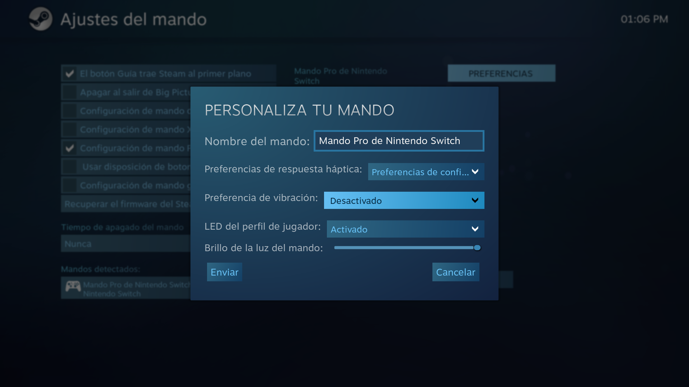
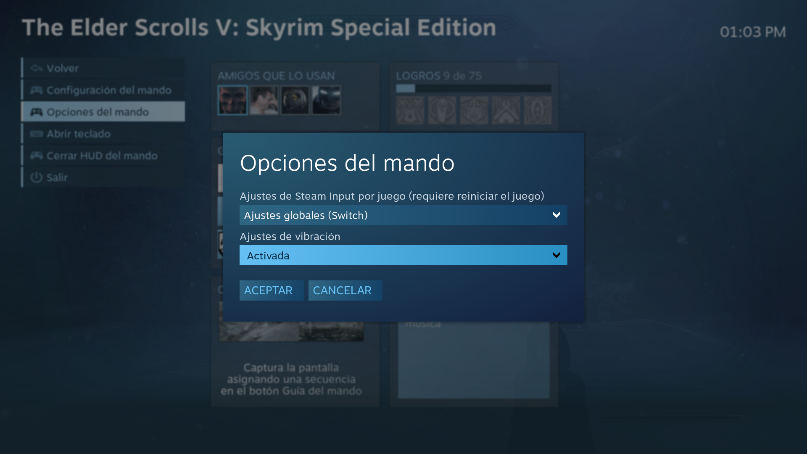

# CONFIGURACIÓN DE AZATHOTH

## BIOS

### MEMORIA RAM

- Usar _perfil 1_ de XMP (va a 2933 MHz).

- Cuidado: al activar un perfil XMP se cambia automáticamente la curva de
  temperaturas y ventilación de la CPU, machacando los valores que había.

- El _perfil 2_ de XMP (que va a 3200 MHz) en principio es compatible según las
  especificaciones de la placa base, PERO hace que el test Prime95 Blend se
  rompa desde el primer momento, cosa que no pasa con el _perfil 1_. [TODO:
  Esto último parece que no es por culpa del _perfil 2_, sino que cuando hice
  la prueba tenía poca memoria libre. Probar de nuevo.]

### OVERCLOCK

- Desactivar `Precision Boost Overdrive`.

### VENTILADORES

#### CPU (fan2 en lm_sensors)

- Ahora mismo lo tengo así:

  ```
  Temp.    %
  ------ -----
   20º     38
   65º     38
   75º     80
   85º    100

  Step up time: 0.7s
  Step down time: 1.0s
  ```

- Otras curvas que he probado:

  ```
  Temp.    %
  ------ -----
   20º     38
   60º     38
   70º     80
   85º    100

  Temp.    %
  ------ -----
   20º     40
   55º     40
   65º     80
   85º    100

  Temp.    %
  ------ -----
   20º     20
   50º     40
   65º     80
   85º    100
  ```

  pero como resulta que `Tdie` está continuamente dando pequeños saltos de unos
  10º, esto provoca que, en ese pico, el ventilador de la CPU pegue un salto y
  luego baje casi enseguida, lo que resulta molesto (y seguramente no sea muy
  bueno para el motor del ventilador).

  Para arreglarlo, pongo el ventilador a una velocidad constante de 38-40%
  hasta los 55º-60º-65º, y a partir de ahí subo la velocidad. [TODO: Probar por
  si hay que poner una rampa más empinada en situaciones de estrés.]

  Es mejor usar el 38% que el 40% para el ventilador de la CPU, porque al 40%
  se oye un zumbido molesto de vibración, sobre todo por la noche.

#### TRASERO (`SYSFAN1` en placa, `fan3` en `lm_sensors`)

- 516 V.

#### DELANTEROS (`SYSFAN3` en placa, `fan6` en `lm_sensors`)

- 516 V.

- Ahora mismo (2020-10-29) hace mucho menos ruido poniendo 660 V. Con 516 V se
  provocan vibraciones a intervalos de un segundo.

- Poner una curva dinámica en los ventiladores trasero o delanteros provoca
  vibraciones y ruido. Mejor poner un valor constante de 516 V. [TODO: Probar
  de nuevo.]

## CAJA

- No apretar todos los tornillos del cristal templado para así evitar ruidos,
  zumbidos y vibraciones molestas. Recomendado apretar sólo los dos tornillos
  superiores y dejar los inferiores al aire.

## MONITOR

- `Contraste`: 50.

- `Brillo`: 40.

- `Gamma`: _Gamma3_.

- Activar `Adapt. Sync`.

## KERNEL

- El kernel 5.8 tiene mejor soporte para los AMD Ryzen 5 y 7 que el kernel 5.4
  que trae instalado por defecto Ubuntu 20.04 LTS.

  Además, resuelve el problema que hace que se pierda el dispositivo de sonido
  en PulseAudio cuando el monitor entra en suspensión.

- Para instalar y usar el kernel 5.8:

  ```
  $ sudo apt install linux-generic-hwe-20.04-edge
  ```

## NVIDIA

- En _NVIDIA X Server Settings_:

  - Poner resolución 1920x1080 a 75 Hz.

  - En `Avanzada` poner `Allow G-SYNC on monitor not validated as G-SYNC
    Compatible`.

  - En `OpenGL Settings`:

    - Activar `Sync to VBlank`.

    - Activar `Allow G-SYNC/G-SYNC Compatible`.

    - La opción `Allow Flipping` se puede desactivar cuando se use _Steam Link_
      en la TV para que no parpadee.

## AUDIO

(Fuente: https://wiki.archlinux.org/index.php/PulseAudio/Troubleshooting)

- Para evitar que el micrófono tenga mucho ruido, lo mejor es usar un enchufe
  con toma de tierra. Eso elimina el ruido de raíz.

- Si no se puede, hacer:

  - `$ sudo vim /etc/pulse/default.pa`

    Añadir al final:

    ```
    load-module module-echo-cancel aec_method=webrtc aec_args="analog_gain_control=0 digital_gain_control=1" source_name=echoCancel_source
    set-default-source echoCancel_source
    ```

  - En el *Control de volumen* de PulseAudio, usar como *Dispositivo de
    entrada* el que ponga `echo cancelled...`.

  - `$ sudo vim /etc/pulse/daemon.conf`

    Establecer:

    ```
    default-sample-rate = 48000
    ```

## RED

(Fuente: https://askubuntu.com/questions/1196348/ubuntu-19-10-wont-connect-to-2-4ghz-wifi-with-txbf-mu-mimo-enabled)

- Para que pueda conectarse a la red WiFi 2.4 GHz con el router TP-Link AC1200,
  hay que usar `iwd` en lugar de `wpa_supplicant`. Para ello:

1. Instalar `iwd`:

   ```
   sudo apt update
   sudo apt install iwd
   ```

2. Crear el siguiente archivo dentro del directorio de archivos de
   configuración de NetworkManager:

   ```
   sudo vim /etc/NetworkManager/conf.d/wifi_backend.conf
   ```

3. Copiar y pegar el siguiente contenido dentro de ese archivo, guardar y
   salir:

   ```
   [device]
   wifi.backend=iwd
   ```

4. Parar y desactivar el servicio `wpa_supplicant` (la desactivación es
   persitente entre reinicios):

   ```
   sudo systemctl stop wpa_supplicant.service
   sudo systemctl disable wpa_supplicant.service
   ```

5. Activar e iniciar el servicio `iwd` (la activación es persistente entre
   reinicios):

   ```
   sudo systemctl enable iwd.service
   sudo systemctl start iwd.service
   ```

6. Reiniciar el servicio de NetworkManager (así no habrá que reiniciar el
   equipo para que los cambios tengan efecto):

   ```
   sudo systemctl restart NetworkManager.service  
   ```

## SISTEMA DE ARCHIVOS

- Para mejorar las prestaciones del sistema de archivos, se puede usar la
  opción `noatime` en `/etc/fstab`:

  - `$ sudo vim /etc/fstab`

    Cambiar `defaults` por `defaults,noatime`
    
  - Para activar en el momento sin tener que reiniciar:

    `$ sudo mount -o remount /`

## JUEGOS

### NINTENDO SWITCH PRO CONTROLLER

- Conectado por USB funciona perfectamente. Conectado por Bluetooth ya funciona
  bastante peor. Para que se desconecte menos hay que seguir unas
  configuraciones y recomendaciones.

- Desactivar la coexistencia Bluetooth-Wifi:

  `$ sudo vim /etc/modprobe.d/iwlwifi.conf`

  Añadir:

  ```
  options iwlwifi bt_coex_active=0 swcrypto=1 11n_disable=8
  options iwlmvm power_scheme=1
  options cfg80211 cfg80211_disable_40mhz_24ghz=Y
  ```

- También se puede deshabilitar el ERTM del Bluetooth, pero creo que eso no
  hace ningún efecto:

  `$ sudo vim /etc/modprobe.d/bluetooth.conf`

  Añadir el siguiente contenido:

  ```
  options bluetooth disable_ertm=1
  ```

- Juegos fuera de Steam:

  - Hay que usar los controladores
    [dkms-hid-nintendo](https://github.com/nicman23/dkms-hid-nintendo) y
    [joycond](https://github.com/DanielOgorchock/joycond).

- En Steam:

  - Los controladores anteriores son incompatibles con el que usa Steam, así
    que hay que deshabilitarlos:

    - Crear `/etc/modprobe.d/blacklist-hid_nintendo.conf` con el siguiente
      contenido:
    
      ```
      blacklist hid_nintendo
      ```

    - `$ sudo systemctl disable joycond.service`

  - Dentro de Steam, hay que:

    - Usar siempre Big Picture.

    - Dejar que Steam detecte el mando como un _Nintendo Switch Pro
      Controller_.

    - Desactivar la vibración en las preferencias del mando:

      

    - La vibración se puede activar por cada juego de forma local durante una
      partida pulsando el botón de la casa y entrando en las opciones del
      mando:

      

### STEAM LINK

- Para que la imagen no parpadee:

  - En _NVIDIA X Server Settings_, opción `OpenGL Settings`:

    - Desactivar `Allow Flipping`.

- Para que el sonido no se vaya degradando y se pierda con el tiempo:

  - En _Control de volumen de PulseAudio_:

    - En `Configuración`, desactivar todos los perfiles de audio.

      Se creará automáticamente un dispositivo virtual `Dummy`. (Si no
      apareciera, arrancar primero Steam.)

- Cuando se acabe de jugar, se deben deshacer los cambios en sentido contrario.

(Fuente: https://github.com/ValveSoftware/steam-for-linux/issues/6749#issuecomment-753639362)

### THE TALOS PRINCIPLE

- Jugar en modo Big Picture.

- En `Configuración del mando`, seleccionar la configuración `Mando`.

### ALIEN ISOLATION

- Es mucho mejor usar Proton 5.0 que la versión nativa de Linux (va más suave y
  con más fps). Para ello:

  - Entrar en las Propiedades del juego.

  - En el apartado `Compatibilidad`, activar `Forzar el uso de una herramienta
    específica de compatibilidad para Steam Play`.

  - Elegir `Proton 5.0-10`.

### CIVILIZATION V

- Para que no se bloquee casi al principio:

  - `$ vim .local/share/Aspyr/Sid\ Meier\'s\ Civilization\ 5/config.ini`

    Poner `MaxSimultaneousThreads = 16`

### THE ELDER SCROLLS V: SKYRIM - SPECIAL EDITION

- Para que se escuchen las voces y la música de fondo, poner los siguientes
  parámetros de lanzamiento:

  ```
  WINEDLLOVERRIDES="xaudio2_7=n,b" PULSE_LATENCY_MSEC=90 %command%
  ```

### THE WITCHER 3: WILD HUNT

- Para que no haya caídas en el rendimiento en fps, poner todo a `Ultra`
  excepto:

  - `NVIDIA HairWorks`: No

  - `Alcance de visibilidad del follaje`: Alta

### MASS EFFECT 2

- Instalar y arrancar una vez.

- La primera vez que se arranca no hay sonido. Las siguientes veces ya sí.

- Extraer `ME2Controller-1.7.2.7z` sobre la carpeta `BioGame` de la instalación
  del juego.

- En Steam, configurar el mando en modo `Mando`.

- El juego se bloqueará si se intenta jugar sin conectarse a Cerberus.

### BIOSHOCK 2

- Para que se carguen bien las texturas y todo vaya más rápido, poner los
  siguientes parámetros de lanzamiento:

  ```
  PROTON_NO_ESYNC=1 %command% -nointro
  ```

### DEUS EX: HUMAN REVOLUTION

(Fuente: https://gaming.stackexchange.com/questions/147596/how-can-i-fix-stuttering-and-lag-issues-in-deus-ex-hr-directors-cut/147642)

- Al salir del juego hay que esperar unos tres minutos o matar el proceso.

- NO usar DirectX 11 para que se carguen correctamente todas las texturas.

- Para reducir bastante los tirones durante el juego:

  - Usar los siguientes parámetros de lanzamiento:

    ```
    PROTON_USE_DXVK=1 PROTON_NO_ESYNC=1 %command%
    ```

  - Poner un antialiasing bajo.

  - Investigar si se trata únicamente de la compilación de shaders. Si pasado
    un tiempo dentro del juego se arregla solo, es que era eso. En caso
    contrario:

  - `$ WINEPREFIX=~/.local/share/Steam/steamapps/compatdata/28050/pfx ~/.local/share/Steam/steamapps/common/Proton\ 5.0/dist/bin/wine regedit`

  - En `HKEY_CURRENT_USER\Software\Eidos\Deus Ex: HRDC`, poner `AllowJobStealing` a `0`.

### NO MAN'S SKY

- En opciones gráficas:

  - Poner la primera opción (tamaño de texturas) a `Media` y el resto de
    opciones a `Alta`.

  - Activar el Vsync.

- La rama 6.0 de Proton funciona mejor que la 5.0.
